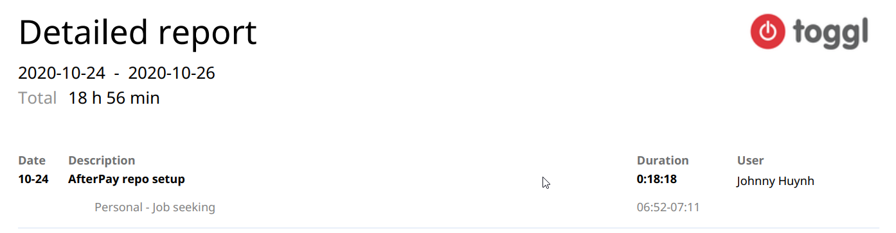
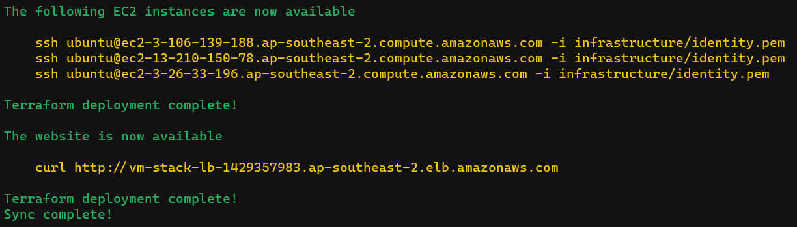

# AfterPay Code Challenge

It gives me great honor to provide you guys with the skill and mindset of a senior cloud engineer through this code challenge. I hope whatever I can contribute here will spark thoughtful discussions ahead.

> I'll be voicing my thoughts on some of these points to understand them through quotes like this 😎

## Outcome


Go to [progress](./PROGRESS.md) logs for my entries throughout the work done.

### Alternative proposal

Due to time constraints I've detailed an alternative method to deploying to the servers that should restrict worker node access via the bastion servers. 


### Time spent

I've used Toggl to record my efforts as I would with any other job. Completion took about ~18 working hours, which equals ~4 business working days.



### Deployment

We can run the following commands on Linux to get it running.

This was tested on Windows 10, WSL 2 Ubuntu LTS 20.

#### Prerequisites

- Make
- AWS credentials with an access key - administrator access for demo purposes
- AWS CLI
- Terraform `^v0.13`
- Python `^v3.8`
- Ansible `^v2.10`
- *Money*

#### Let's do it

Change directory to the root repository and run the following commands.

```bash
# Please find the tools from the prerequisites, I'll put brew commands here in case
brew install awscli terraform ansible python

# Create 
make init

# Apply Terraform and Ansible changes
make sync

# Teardown the stack
make destroy
```

Ta-da! You should have the VM stack mentioned in this challenge. There should be a message detailing you to access nodes and visit the load balancer DNS.



### Development

Since this is a VM based deployment, we can use simple make commands to sync changes to the servers.

I haven't considered blue-green deployments via Ansible but it is a suggestion.

```bash
# Apply Terraform and Ansible changes
make sync
```

## Overview

- Provision a Linux VM based environment in AWS
- Host a web server at port 80
- Demonstrate infrastructure as code and configuration as code

## Minimum requirements

- [x] Choose any host Linux OS

- [x] Patch to recent security packages

- [x] Disable `IPv6`

> Curious to why we want this off, discussion required

- [x] Install the following packages 
  - `ntp`
  - `telnet`
  - `mtr`
  - `tree`

> Installing miscellaneous tools, though I would like to be curious to see why we need them

- [x] Set max open files limit across all users/processes, soft & hard
  
> This one is a fairly specific change, though may be warranted perhaps due to the company identifying this as a problem in their VMs

> Further question, how we do test this capability?

- [x] Setup AWS Linux OS image with relevant pre-boot setup

> Hopefully [Terraform](https://www.terraform.io/) and [Ansible](https://www.ansible.com/) are good fits for this

- [x] Setup the web server from the test application and make sure it's available on port 80

> I will comply to the requirement, but will try offer an alternative more secure connection if I get time

- [x] Ensure server is locked-down and secure

> This point here contradicts the fact that we're running the web server on port 80, leaving it susceptible to man in the middle attacks deeming it less secure
> 
> We can still lock our host VMs down via route tables and security groups in AWS to only allow certain users access to the VMs via SSH

Provide documentation on:

- Deployment
- Prerequisites
- Explain design choices
  - Why I chose what I chose
  - Short comings
  - Assumptions

## Brownie points

Here are my additional changes I may or may not get to do. The end goal of this setup is to host a simple web server, but I want to see what alternative ways I can approach this on top of the code challenge.

- [ ] Honeypot SSH
- [ ] Restrict SSH via security groups
- [ ] Build a staging and production environment
- [ ] Use Ansible Vault to seal secrets like SSH keys
- [ ] Use a [pull based solution on Ansible](https://docs.ansible.com/ansible/latest/user_guide/playbooks_intro.html#ansible-pull) to pull changes from this repo to deploy the application
- [ ] Use a locked down IAM user to deploy this stack - instead of my personal admin account
- [ ] Add this into a CI/CD pipeline
- [ ] PR based infrastructure deployments - [Atlantis](https://www.runatlantis.io/)
- [ ] Enable HTTPS on the web server and add a redirect route on port 80
- [ ] Provision this in a container environment like EKS - *because I fucken love [Kubernetes](https://kubernetes.io/)*

## Assessment criteria

Must have code stored in source.

> This is a must have for me, I don't understand why people don't always do this 😅

Linux OS image chosen

Deployed on AWS

Configuration management tooling like [Ansible](https://www.ansible.com/), Chef or SaltStack

> I've used Chef at my current workspace for this, though I'm going to try [Ansible](https://www.ansible.com/) for a more streamline setup - by the fact that we don't need to provision Windows VMs is another bonus, this is why [Ansible](https://www.ansible.com/) suits this 🙂

Infrastructure as code like Terraform or Cloudformation

> I wish to use [Pulumi](https://www.pulumi.com/) in this, but I'll stick to my guns and use [Terraform](https://www.terraform.io/) to provision the underlying infrastructure here

Web server is available on port 80

> Let's do this but long-term it should be through CA authority TLS via port 443

Server is locked down and secure

> As mentioned, there's a contradiction to this point to the one above but I will provide the best secure approach possible in this timeframe

Anti-fragility

> This point is a good one, I commend the person writing this to be an assessment that should be recognised
> 
> There's a few any to approach this, we can use process controllers like [supervisor](http://supervisord.org/) to manage the lifecycle of a process like a web server on a host
> 
> This will solve the problem in the meantime, though will it scale? It's a host-specific change to maintain processes. What if we want to have multiple VMs load balanced? We can potentially use Ansible to manage these change going forward
> 
> We can **also** tackle this at the host level and perhaps use containerised environments. This is where orchestration tools like Kubernetes shine in terms of failover and application lifecycle control

Code & documentation layout

> This is must have in terms of writing and documenting code, it not for robots to read. It's for other humans

Ease of deployment

> This is also a must have, it should almost be fool-proof in terms of provisioning critical infrastructure

Simplicity

> KISS - keep it simple, stupid
